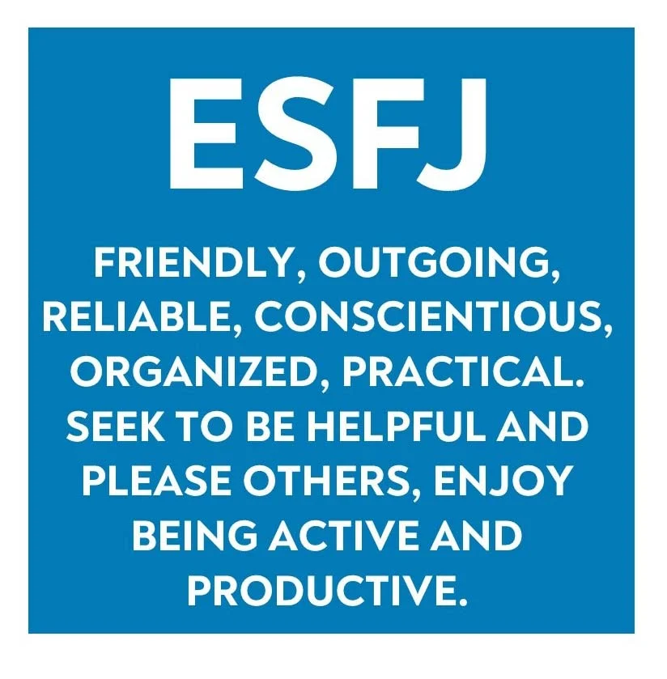
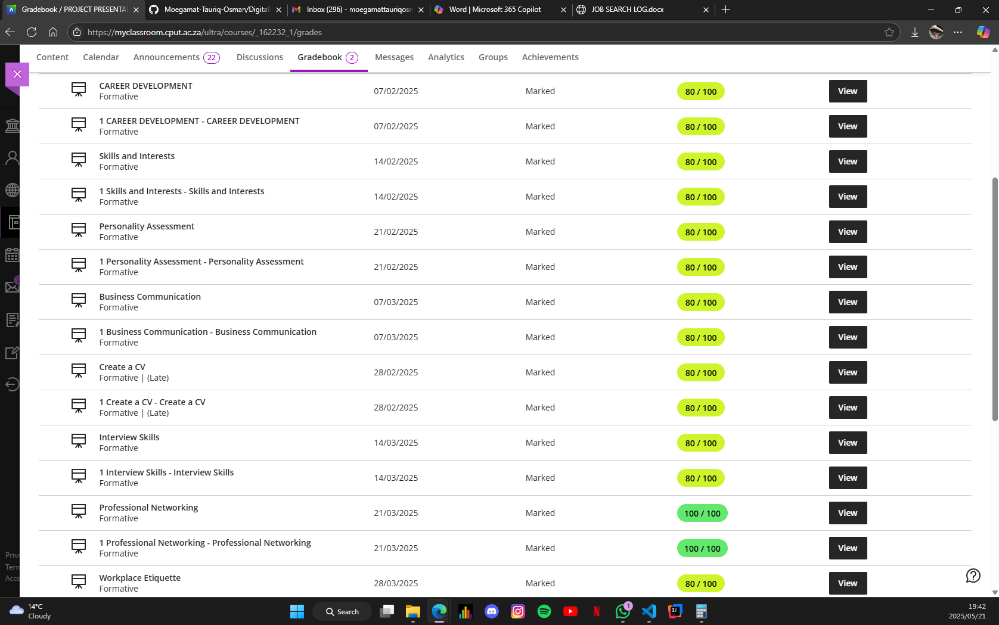
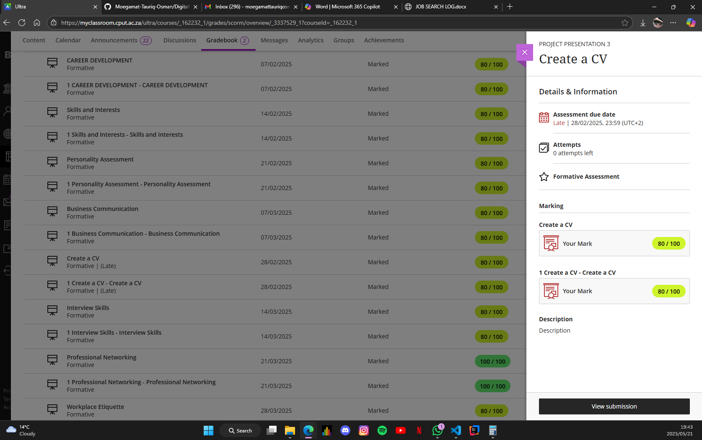

# Moegamat Tauriq Osman - Digital Portfolio

> 🎓 Information and Communication Technology Student: Applications Development

Welcome to my digital hub. Here, you'll find my projects, ideas, and the stories behind them. It's a glimpse into my passion for learning, creating, and pushing boundaries. Have a look and see where my journey is headed.
---

## Contents
- [Career Counselling](#-career-counselling)
- [Skills & Interests](#-skills--interests)
- [Personality Assessment](#-personality-assessment)
- [CV Creation](#-cv-creation)
- [CV Submission](#-cv-submission)
- [Final Reflection](#-final-reflection)

## Career Counselling
Since primary school, I’ve been passionate about tech and fascinated by games. As I grew older, my curiosity about how games and apps are built only deepened.

High school was a turning point—seeing my cousin stay up late studying with stacks of books inspired me. I approached her one day and asked what she was learning. She told me she was studying Information Technology, which involves building applications and working with technology. That moment sparked my interest in tech even more and set me on a path to explore and learn about the exciting world of IT.

My cousin helped me understand career options in Information Technology but out of all of them Applications development stood out the most.

Below is my career advice document:
[View National Career Advice Portal PDF](./National-Career-Advice-Portal.pdf)

---

## Skills & Interests

While pursuing my studies in Information and Communication Technology, I became deeply interested in how digital systems are designed and how applications function behind the scenes.

I set out to develop both my frontend design and backend development skills to bridge the gap between user experience and system logic.

I created intuitive wireframes and interactive prototypes using Figma, turning abstract ideas into user-friendly interface designs. On the backend, I designed relational databases and wrote efficient SQL queries to manage structured data. I also built and maintained clean, modular codebases in Java, applying Object-Oriented Programming (OOP) principles and debugging to ensure optimal performance.

These experiences improved my logical thinking, attention to detail, and problem-solving abilities. I’m now confident in designing seamless user experiences and building scalable backend systems. I continue to explore how thoughtful design and solid development practices can come together to create meaningful, reliable applications.

Visit my personal website to explore my projects:

🔗 [My Personal Portfolio Website](https://moegamat-tauriq-osman.github.io/)

---

## Personality Assessment

Understanding my personality has helped me with my self-awareness and choose environments where I thrive pe that value structure, collaboration, and purpose. As someone with an ESFJ Consul personality, I am naturally drawn to roles where I can support others and bring order to complex situations.

I see myself as reliable, empathetic, and highly organized. These traits influence the way I work on projects whether it’s maintaining clarity in a team or ensuring the processes run smoothly behind the scenes. My motivation often comes from helping others succeed, and I find real fulfillment in being part of something that improves people’s lives or experiences.

I prefer settings where communication is open and responsibilities are clearly defined. I am constantly learning to balance my drive to support others with the need to set boundaries and care for my own wellbeing. I’ve also grown more comfortable with feedback, using it as a tool for improvement rather than taking it personally.

Traits that could support my growth and effectiveness in a team or technical environment:

- Strong sense of duty and follow-through

- Empathy that strengthens team collaboration

- Natural ability to organize and manage time

- A desire to contribute positively to group goals

- Attention to detail and pride in well-done work

These has helped me build  meaningful relationships and contribute in ways that are both thoughtful and dependable. Understanding personality is not just about personality labels, for me its about about making intentional choices, building healthier habits, and carving a career path that feels both authentic and rewarding.

below is my personality report:

[My Personality Report (PDF)](./ESFJ_Personality_Report.pdf)

---

## CV Creation

Creating my CV was an important step as i now understood what a CV intails which I'v learned through a module Project Presentation(Work Integrated Learning) which gave me the oportunity to make sure all my skills, achievements and aspirations are listed clearly from structure, formatting, qualifications etc. It gave me a clearer perspective on how to position myself effectively on how to strategically align my skills and goals for future opportunities and long-term success.

### Project Presentation - Work-Integrated Learning (WIL) Module
The module helped me alot on understanding how to create a presentable CV, Condsucting myself for an interview but primarily gives you the get go for work readiness, applying yourself to the real world in your field.

---

## CV Submission

Below is my CV(not complete due to sensitive information), compiled during the Project Presentation Work Readiness and Work-Integrated Learning (WIL) module. It highlights my academic background, technical skills and interests.

I have also completed a Job Search Log which is to keep track of which organisations or capanies you have applied to by monitoring progress and opportunities.

📄 [View My CV](./CV.pdf)
📄 [View My Job Search Log](./JOB-SEARCH-LOG.pdf)

---

## Business Communication
### Evidence
I completed the Business Communication module as part of the Work Readiness training which focused on professional communication and the importance of it in the workplace.

### Reflection (STAR Technique)

**Situation:**  
I was required to engage in and complete the Business Communication activity as part of the work readiness module aimed at strengthening my communication to be professional in the workplace environment. 

**Task:**  
The goal was to understand and apply professional communication practices like tone, language and etiquette in the workplace wether it being in an email or virtual setting.

**Action:**  
I took part in enaging and understanding the material aswell as answer a few short questions based on context i read, which tested me on topics like the use of formal language in business settings, tone for business emails, and etiquette in virtual meetings.

**Result:**  
By the end of the activity, i gained a clear sense of the importance of professional communication in the workplace and business settings. The activity helped me improve how i conduct myself when it comes to professionalism and etiquette in my use of formal language, the tone when structuring emails and professional etiquette in virtual meetings.

---

## Interview Skills
### Evidence
I completed the Interview Skills module as part of the Work Readiness training and answered short questions covering topics like, the purpose of job interviews, CAR (Context, Action, Result) method for answering questions in interviews, researching companies before interviews, answering questions such as “Tell me about yourself” and the best approach to addressing your weaknesses when asked about it.

### Reflection (STAR Technique)
**Situation:**  
I needed to develop professional interview skills and practice them to prepare myself for future job interviews.

**Task:**  
Understand interview techniques and how to present myself and answer questions confidently and professionally.

**Action:**  
I engaged in reading the materials, understanding it, practicing the CAR method, how to best answer questions about myself and completed the short quiz questions at the end of the module.

**Result:**  
I improved and felt more confident , gaining some practical skill to handle interviews and present myself professionally when being interviewed.

---

## Mock Interview
### Evidence
I completed the Business Communication training activity from the work rediness module which focused on professional communication and the importance of it in the wrokplace.

### Reflection (STAR Technique)
**Situation:**  

**Task:**  

**Action:**  

**Result:**  

---

## Professional Networking
### Evidence
I completed the Business Communication training activity from the work rediness module which focused on professional communication and the importance of it in the wrokplace.

### Reflection (STAR Technique)
**Situation:**  

**Task:**  

**Action:**  

**Result:**  

---

## Workplace Etiquette
### Evidence
I completed the Business Communication training activity from the work rediness module which focused on professional communication and the importance of it in the wrokplace.

### Reflection (STAR Technique) 
**Situation:**  

**Task:**  

**Action:**  

**Result:**  

---

## Final Reflection

This portfolio journey has helped me better understand who I am—not just as a student, but as a growing IT professional. I've realized that it's perfectly okay to still be discovering my path, as long as I'm intentional with how I learn, the projects I take on, and how I present my skills and ideas. Each step has strengthened my passion for building practical, user-focused applications and finding innovative solutions through technology.

---

### Connect with Me

[LinkedIn](https://www.linkedin.com/in/moegamattauriqosman)  
[My Personal Website – About me, Contact Info, Skills, Github Projects](https://moegamat-tauriq-osman.github.io/)  
Email: moegamattauriqosman@gmail.com | 230599125@mycput.ac.za

